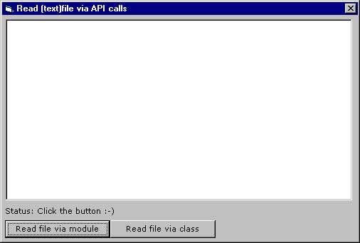



## Read a textfile via api calls \(v1\.1\)

### Description

This code is designed for reading text files. i have written this code because i did not want to use the slow "open for input..." and "freefile" bla bla code...

I know i coul do this via the richedit control, but i wanted to know how to do it via api, and maybe you to...

This code is using the "CreateFile" Api, which must be called differently in windows 2000. Therefore, i added a "IsWin2000" function to check for windows 2000.

Update: Now added a class which wraps the module, lot's of events and functionality. it's 50ms slower in read (with my test file)

Class module includes also function ReadCharacters which reads the specified ammount of characters from the open file.
 
### More Info
 
You could get an "out of memory error" when you try to read text files larger then 32768 bytes, and put that into a textbox. Therefore, if you want to display text, use richedit boxes.

             |
---                |---
**Submitted On**   |2000-12-20 10:20:42
**By**             |[G\. van den Hoven](https://github.com/Planet-Source-Code/PSCIndex/blob/master/ByAuthor/g-van-den-hoven.md)
**Level**          |Intermediate
**User Rating**    |4.3 (17 globes from 4 users)
**Compatibility**  |VB 6\.0
**Category**       |[Files/ File Controls/ Input/ Output](https://github.com/Planet-Source-Code/PSCIndex/blob/master/ByCategory/files-file-controls-input-output__1-3.md)
**World**          |[Visual Basic](https://github.com/Planet-Source-Code/PSCIndex/blob/master/ByWorld/visual-basic.md)
**Archive File**   |[CODE\_UPLOAD1286012202000\.zip](https://github.com/Planet-Source-Code/g-van-den-hoven-read-a-textfile-via-api-calls-v1-1__1-13679/archive/master.zip)

### API Declarations

All in module, sample project included.

